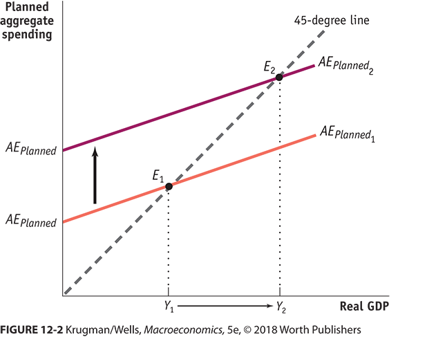
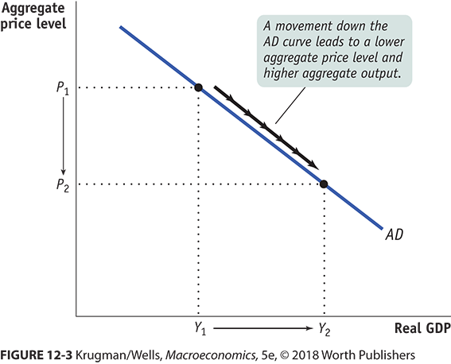
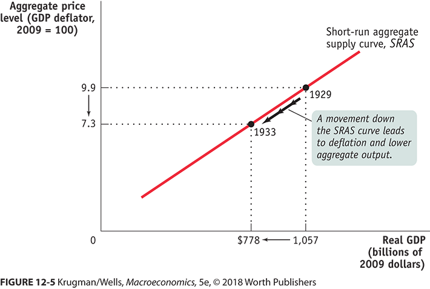
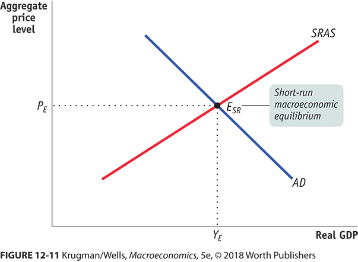
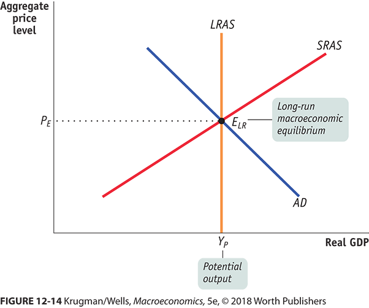
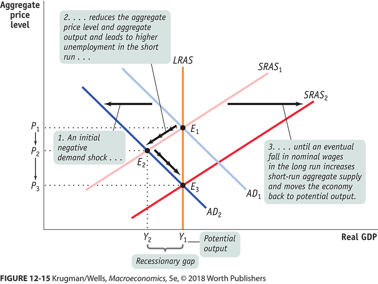

```{r setup, include=FALSE}
knitr::opts_chunk$set(echo = FALSE)
```


## Goals


+ Build **aggregate demand**, which shows the relationship between the price level and real GDP, from the income expenditure model.
+ Intuit **short-run aggregate supply** from what we know about supply.
+ Introduce **long-run aggregate supply**
+ Show how an economy reacts to a shock in both the short and long run.


## Big Intuition Time

Aggregate demand and supply show the relationship between real GDP and the price level.

The slopes are mostly because of **sticky nominal wealth and wages**.

+ Your wage rate is nominal.  When prices go up the value and cost of your wages fall.  Basically, the higher the price level, the cheaper it is to pay you
+ Your wealth is also nominal.  When prices go up the value of those cash assets falls. Basically, the higher the price level, the poorer you feel.


## Building Aggregate Demand

Consider that you have \$1M in the bank and the CPI is 200.

+ You have real wealth of $\frac{\$1M}{200} 100 = 
\$500K$
+ Your savings makes you feel pretty bad about spending money now. It doesn't feel like enough. (BTW Better than most people.)
+ So you reduce your autonomous spending, $A_0$ in  $AE_{Planned} = A_0 + MPC yd$


## But Then the Price Level Decreases


Now the price level goes from 200 to 100.

+ You have real wealth of $\frac{\$1M}{100} 100 = 
\$1,000K$
+ You feel rich 
+ You increase autonomous spending.
    + That shifts up the expenditure function
    + That increases equilibrium expenditures
   
    
## Like This





## The Idea





## To be clear


+ This is not about other goods being relatively more or less expensive.
+ But, just like microeconomics
    + Increase is to the right
    + Decrease is to the left
    
## Things That Increase Demand 

Flip the sign to decrease

+ Consumers are optimistic about the future
    + I will have a better job in the future and will spend more now.
+ There is an increase in the **real** value of wealth.
    + Not inflation, but what you can buy.
+ Small existing physical capital stock
    + You need to grow it.
    + The 2008 crash was a housing bubble, lots were built, too much.  
        + It took years to soak up those extra houses.
        + One reason why recovery took so long.
        
## Things That Increase Demand (Con't)
        
+ Government cuts taxes or increases spending (Fiscal Policy)
    + Remember that tax cut we just got?
+ More money or decreases in interest rates
    + Both increase investment
    + Note that we are raising interest rates now.
    
## What About Aggregate Supply?

This depends on wages being sticky in nominal terms but prices of goods being flexible.

## Example

+ Suppose the price level is 100 and your wages are 100K per year.  Also suppose that your employer just breaks even on you.  
    + The value of what you produce is exactly equal to your salary, 100K.
+ Now the price level goes to 200
    + The value of what you produce is 200K
    + You are still paid 100K
    + Your employer hires more people just like you.
    + Output, real GDP, goes up

Price level goes up and output increases.


## Flip the arrows in this diagram


  


## Things That Increase Supply


Remember you can flip the increase/decrease to get decrease.

+ Commodity Prices Fall
    + Energy prices are a classic.
    + BTW it gets tricky if you are  a producer of commodities, but that changes demand.
+ *Nominal* Wages fall
    + Cheap workers? Hire them to make more stuff.
+ Productivity Increases
    + Remember TFP
    
## Put them Together


 


## You now can 

+ Determine the price level and real GDP at the same time.

+ IRL, we think about the vertical axis being the inflation rate and not the price level.  This is just easier to wrap your head around.

## That is Just Short-Term

There is also a long-term aggregate supply function

+ It is a little odd.
+ It could be the level of output consistent with non cyclical unemployment.
+ Or output consistent with NAIRU
+ Or built up statistically

In any case, it is a number that does not change with the price level. The Congressional Budget Office Estimates it. https://fred.stlouisfed.org/series/GDPPOT


## Long-Run and Short-Run Equilibrium





## Lets play with the Dynamics of this


+ Keep in mind that AD is the same in the short-run and the long-run
+ In the long-run
    + Short-run AS shifts
    + Eventually shifts to where AD crosses LRAS.
    
## Lets Play Some Examples


People suddenly believe there will be a recession in the future.

+ This actually causes a recession.
+ AD shifts left
+ Short-run
    + Price level falls
    + Real GDP fall (Here is the recession)
+ Real GDP less than potential means there is unemployment.
+ Long-Run (All prices are flexible, even wages)
    + Wages fall because unemployment
    + Wage decreases cause an increase in SRAS
    + Keeps happening till real GDP is equal to potential GDP
    
    
## Picture





## Try Again


## Next Up


Fiscal Policy


