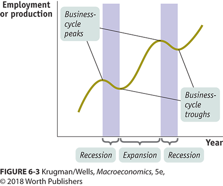
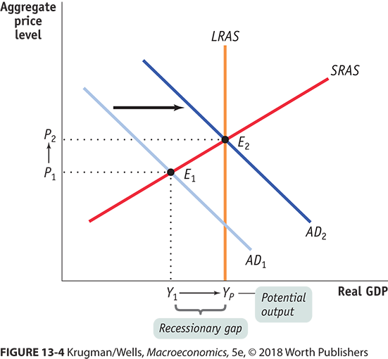
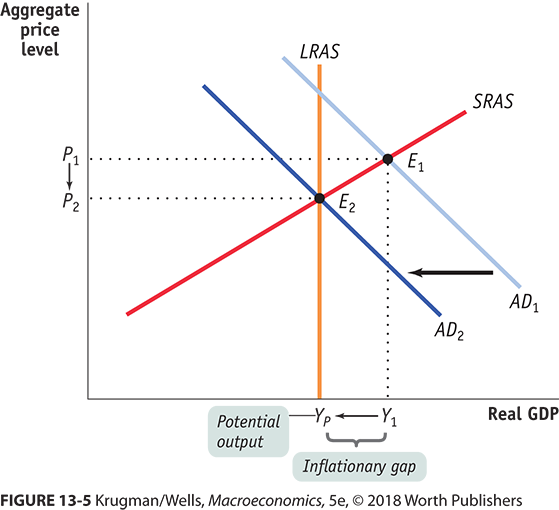
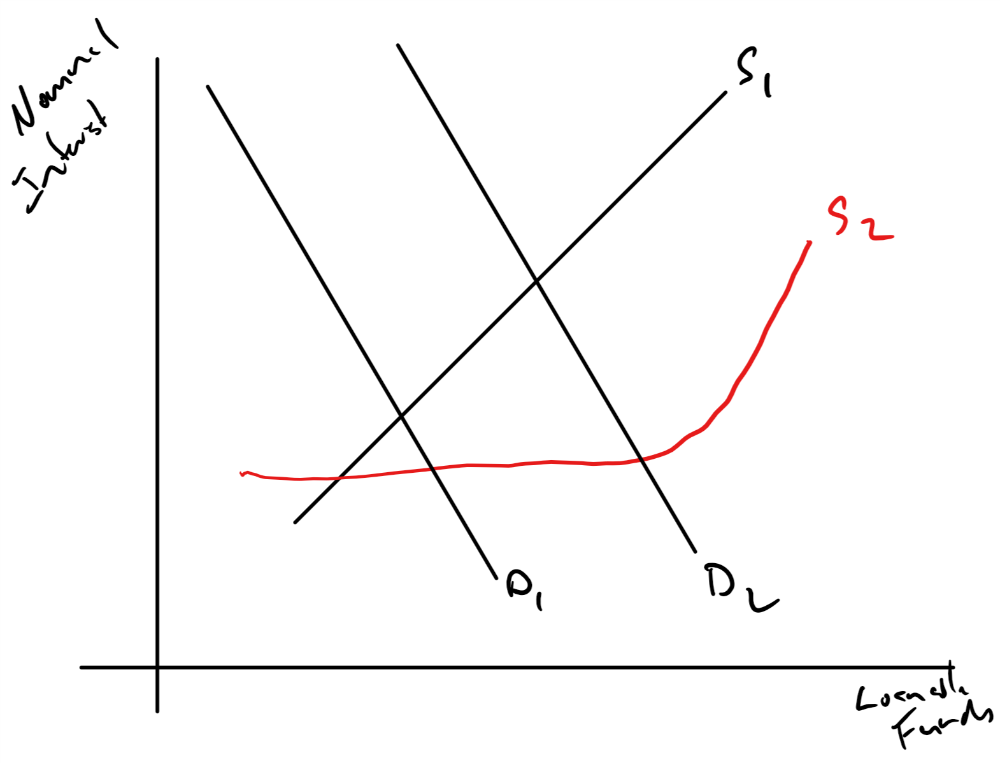
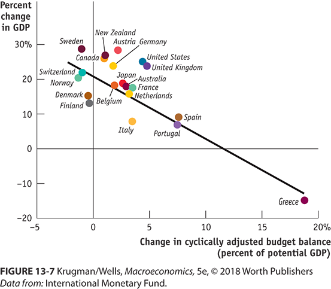
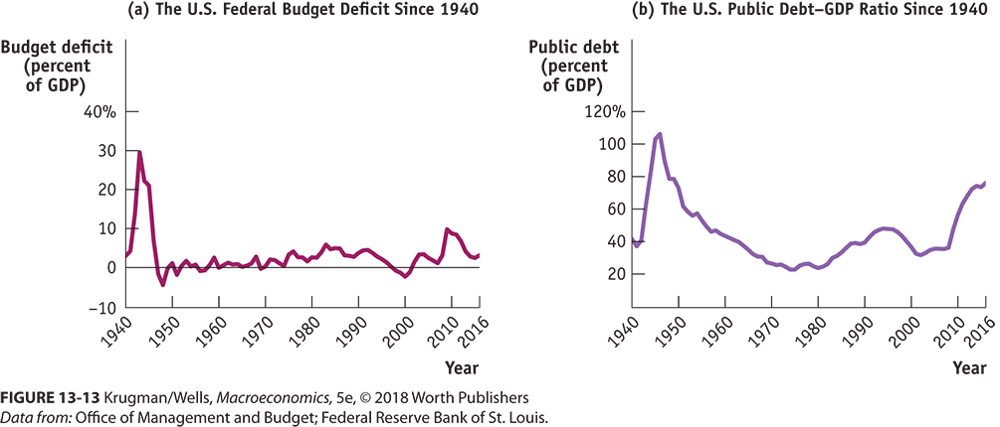

```{r setup, include=FALSE}
knitr::opts_chunk$set(echo = FALSE)
```


## Goals

Talk about fiscal policy:

+ Scale
+ Theoretical effect
+ Critique
+ Implementation difficulties


## Where are we in the business cycle




## Probably A Little Overheated

+ Unemployment is below 
+ Most models of recessions are ticking up in the next year. 
    + https://www.newyorkfed.org/medialibrary/media/research/capital_markets/Prob_Rec.pdf
    + https://www.clevelandfed.org/our-research/indicators-and-data/yield-curve-and-gdp-growth.aspx

## Remember What We are Trying to Do

We don't want to get overheated

+ Negative cyclical unemployment
+ Inflation pressure (Remember the Phillips Curve Relationship)

We don't want to be in recession

+ Positive cyclical unemployment
+ Other labor market harm (Remember that you can be underemployed in the U-6 sense)

## Each Has Different Prescriptions

+ If recessionary gap, increase aggregate demand
+ If inflationary gap, decrease aggregate demand.

We are trying to get back to potential GDP faster than the long-run response.

##  Close Recessionary Gap By Increasing AD



## Close Inflationary Gap By Decreasing AD



## How?

The high level story?

+ Recessionary gap: Cut taxes, increase spending, increase transfers
+ Inflationary gap: Increase taxes, decrease spending, decrease transfers.


## Fundamental Problem

Not all the effort that we count helps. In most economics this is what is called *the program effect*

+ What would have happened without the program
+ What happened with the program
+ The difference is the program effect.

The problem is that it is hard to observe something that didn't happen.

## Example with Unemployment

Suppose we have a country with three workers: Alice, Bob and Charlie.

+ Recessionary Gap
    + Alice is employed in private sector, but not Bob or Charlie.
    + The Government hires someone.
    + Alice and Bob are employed.
    + Net effect - One fewer unemployed.
+ Inflationary Gap
    + Alice, Bob and Charlie are all employed by private sector.
    + The Government hires someone.
    + Alice and Bob are employed by private sector
    + Charlie is employed by the government.
    + Private sector is now  looking for someone - Dee?
    + Net effect - no change in employment.
    
## The Net Effect is Different

It really depends on where you are in the business cycle.

## Claim 1

Government spending always crowds out private spending.

+ If in an inflationary gap -- sure.
    + Could  be for every person hired because of government spending, .9 people leave their current job.
+ If in a recessionary gap?
    + If you see unemployed and they are hired when they otherwise would not, then no crowding out.
    
## Claim 2

Government Borrowing Always Crowds Out Private Investment Spending.

+ Government borrowing represents an increase in the demand for loanable funds.
+ An increase in demand for loanable funds results in more funds loaned and higher interest rates.
+ Higher interest rates decreases investment.

But, what if interest rates don't go up?

## Claim 2 A Picture with Two Stories




    
## Claim 3

Government Budget Deficits Lead to Reduced Private Spending.

+ Called the Ricardian Equivalence argument.
+ People are smart and can forecast the effects of government policy.
+ Government deficits must eventually be paid for by taxes.
+ When people see the government running a deficit, spending more than taxes, the immediately save enough to pay for the future tax bill.

This one has *some* meat but it is not a full adaptation.

## What Does Cause the Problems?

Lag

https://www.youtube.com/watch?v=_fNp37zFn9Q


## What Lags for Macro

+ All our statistics have noise
    + Remember uncertainty about unemployment
    + GDP revisions
    + Price level uncertainty
+ We don't know when we are in a recession till after it started.
    + The last recession started in December 2007, but was announced in December 2008.
    + It ended in June 2009, but was announced in December 2010.

## More Lags

+ Planning to spend money should take time.
    + Even in a recession, blowing $1B on Vodka and Doughnuts is a bad idea.
    + Are you really sure something new is happening.
+ Fast often means nothing new
    + American Recovery and Reinvestment Act of 2009 (ARRA) was looking for shovel ready projects.
    + Things you were just about to do.
    + Things you decided you were not going to do.
    + It takes a while to get a project shovel ready.
+ Spending money takes time
    + Federal ARRA spending didn't really hit till 2011, i.e., after the recession was over and after it was announced over (December 2010).
    
## How to Deal with Lag?    
    
+ Just like in games, no sudden moves.
+ Increase the number of things that automatically do the right thing.

## Automatic Stabilizers

+ With recessionary gap
    + Automatically increase expenditures
    + Automatically decrease taxes
    + Automatically increase transfers
+ With inflationary gap
    + Automatically decrease expenditures
    + Automatically increase taxes
    + Automatically decrease transfers
    
## Tax Collections as Stabilizer

+ Plan a balanced budget 100M with 10% tax on 1,000M national income
+ National income is only 800M
    + Expenditures don't change, still 100M
    + Tax collection falls to 10% of 800M -- 80M
    + 20M deficit stimulates
+ National income is 120M
    + Expenditures don't change, still 100M
    + Tax collection increases to 10% of 1200M -- 120M
    + 20M surplus is contractionary

## Other Stabilizers

+ Unemployment insurance compensation increases in recession.
+ Medicaid (Healthcare for poor) and food stamps increase in recession


## Balanced Budgets?

+ Not if you want year-to-year balanced budgets.
+ You need the right time-frame.
+ Thought experiment.  Balance your budget day-to-day and not month-to-month.
    + Payday:  Go to Costco, fill all freezers, pay every bill you can.
    + No income in a day, no expenditures.  
        + Day off? Can't spend anything
        + Workday?  Now you can buy lunch if you want
+ The correct time unit is probably a business cycle not a year.

## Doesn't Mean We Don't try

+ State and local governments are often prohibited from running deficits.
+ Not to say they can't borrow
    + They borrow for cash flow reasons during the year, e.g., tax anticipation bonds
    + The borrow for large capital improvements with tied funding to pay back, e.g., school construction bonds.
+ In the 2008 recession, federal spending expanded but state funding contracted.
    + One might say that federal spending crowded out state/local spending, but that is torturing the concept.
    
##    


    

## We can estimate ...

+ There is an idea of a cyclically adjust budget deficit.
    + Use current law and estimate what tax collection and expenditure would be under the law.
    + Current estimates for the world by the [**IMF**](https://www.imf.org/external/datamapper/GGCBP_G01_PGDP_PT@FM/USA)
    + Note that those are for the national governments.

## There are also total estimates of the effects of fiscal policy

You can also find the net effect [**here**](https://www.brookings.edu/interactives/hutchins-center-fiscal-impact-measure/

+ Yes, you are reading that right, we were contractionary from 2011 till 2015.
+ Neutral until recently.
+ Yes, we had tax cuts and are running large deficits, but it takes a while to kick in

## We Know Direction

What about scale of contractionary and expansionary fiscal policy?

+ The classic response is to look at the expenditure multiplier for extra spending.
+ The tax multiplier for tax cuts and transfers

We will look at theoretical and empirical multipliers.

## You know the expenditure multiplier

$$\frac{1}{(1-MPC)}$$

\$1B increase in government expenditures, when the MPS was .05, i.e., MPS of .95, would mean an increase of:

$$\$1B \frac{1}{(1-.95)} = \$20B$$

## The tax multiplier

The tax multiplier is a little smaller

$$\frac{MPC}{(1-MPC)}$$

The logic is:

+ If the government spends the money directly it spends all of it.
+ If they give it to you, you only spend part of it, MPC times what you.
+ The book gives a longer infinite series argument.

## The Multiplier IRL

+ We don't see expenditure multipliers on the scale of 20 or 5.
+ More likely between 1 and 3.
    + That would mean that the MPS was between 1, save all additional income, to 1/3.
    + The concept is right but more happens  in the real world.
    
## Multiplier of 1.8



    


## The Multiplier Depends on 

+ Who you give tax cuts and transfers to
    + Rich save more, smaller multiplier
    + Poor save less, larger.
+ Local Firms
+ Expenditures for services vs things

If anyone ever asks, say the multiplier is $2 \pm 1$. 

Also, tell them that the tax multiplier can be less than 1.

## But the Long-run

There is a good chance  that lowering taxes has long-run supply side effects.

+ A tax cut now may shrink current GDP, because the empirical tax multiplier could be less than 1.
+ But, result in more investment, increasing AS, which increases future GDP.

Your mileage may vary depending  on a lot of details.

## Deficits and Debt

+ Deficit:  The difference between revenue and expenditures.
    + Collect \$1B in taxes and spend \$1.2B, you have a deficit of \$200M.
    + Deficits are a flow measure
+ Debt:  The sum of deficits and surpluses
    + Run a deficit of \$200M a year for 10 years.
    + Your debt goes up by \$2B.
    
## Our Debt and Deficits

Talking about billions and billions is not always helpful.  You need to think about it in the right scale.

+ Scale is not always obvious.
    + We use vehicle miles traveled for travel safety.
    + Makes sense  for cars, planes, etc.
    + But until 1974 the Saturn 5 rocket, which made trips to the moon was the safest on a per mile basis.
+ We generally talk about deficits and debt on the scale of GDP.

## Deficits and Debt




## Comments

+ Yes, 2008 was special.
+ We reduced debt in the 90s
+ Kicked both up after 2001.

## Oh you want a number?

[**Here you go**](http://www.usdebtclock.org/)

Please don't take this that seriously.  GDP is an annual rate and does not go up constantly like that.

## Logic Check on the Public Debt

+ Borrow \$10 at 5\%.
    + Doubles in $\frac{70}{5}= 14$ years.
+ Invest at 10\%.
    + Doubles in $\frac{70}{10}= 7$ years.
    + Quadruples in 14.


Why pay it back when the cost is less than the benefit? Paying it back would reduce the benefits you receive.


## Next Up

MONEY
        


<!-- + Where taxes come from -->
<!-- + What we spend it on. -->
<!-- + liabilities vs implicit liabilities -->


