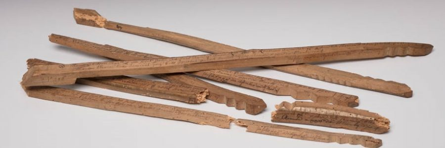
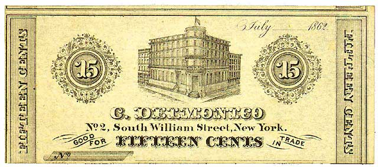
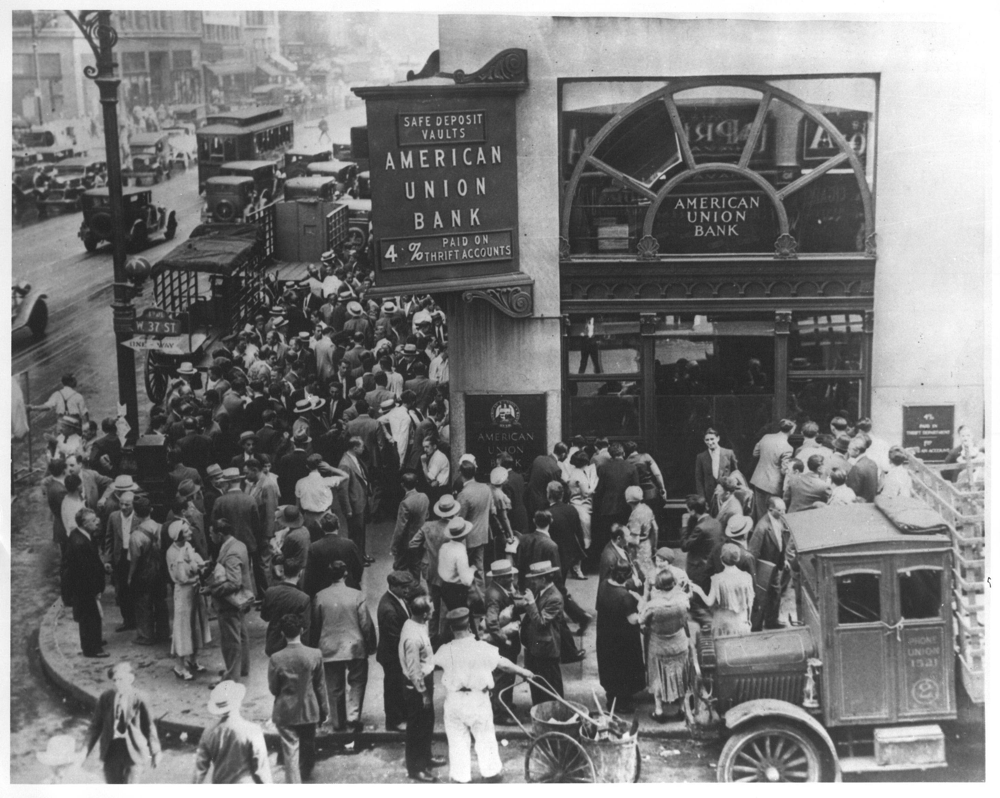

```{r setup, include=FALSE}
knitr::opts_chunk$set(echo = FALSE)
```


## Goals

+ Wrap our heads around "money"
+ What makes for good money
+ How we measure it
+ How we manipulate it


## What is Money

Money has three attributes:

+ Unit of account
+ Medium of exchange
+ Store of value

Probably in that order of historical development and importance.

## Unit of Account

This just means a way of keeping score

+ Our earliest written records are accounting records.
    + Closely tied in with the development of writing.
    + Babylonian temples stored goods and kept track of ownership.
+ You could order transfers.
+ Basically, we had checking before we had coins.

## Then The Sea Peoples

+ Around 1200 BCE, Western/Middle Eastern Civilization collapsed.
+ Who would do the accounting?
+ Solutions:
    + A distributed accounting system -- Ox hide shaped ingots
    + Coins
    + Tally sticks
+ Coin/ingots where more for long distance.  They were a bigger promise
+ Tally sticks were more local

## Tally Stick



## The Idea

+ Different marks for different values
+ Split it down the middle to make sure nobody changes anything and that only those two half fit together.
+ Now you have a value owed, the foil, and the value that can be called on, the stock.

## Quaint??

+ Henry I introduced these for taxes in about 1100
+ You were paid in sticks, and other stuff, and you paid in sticks and other stuff.
+ Did that right up to about 1826 but the other stuff was more prominent before that.
+ They tried to burn the stocks and foils they still had in 1834 and were so enthusiastic they accidentally burned down most of Parliament.

## So Yea


## Coins Were Not Always Easy

+ They were a larger promise that you would be paid back.
    + Tally sticks were wood
    + At least coins had valuable materials/metals and could be tested.
+ Depended on everyone liking the same metals
    + Gold, silver and other metals were common
    + Where the west got the idea that gold should be the basis for money.
    + Where the east got the idea that silver should be.
    + That east/west silver/gold pattern generated a lot of history.
    
## Nor Easy to Keep Track of

+ Medieval market towns could see more than 1,000 different kinds of coins.
+ Even paper money was hard:
    + China did it first in 7th century. There were earlier attempts but not widespread.
    + Paper does not feel like much of a promise.
+ US had a "free banking" period, 1837-1864 where everyone made currency.
    + Banks issued them.
    + 30,000 different notes to keep track of
    + Value declined with distance from issuing bank
    + Banks also only lived about 5 years

## 



##  What Next

Widespread paper money issued by the government, or government-like, is only from about 1850ish. 

+ Don't think that commodity money, i.e., gold coins, or commodity backed, i.e., exchangeable for gold, is better
    + Relative prices of mixed commodity money messes this up -- Gresham's  law.
    + You need to have the money grow at about the rate the economy grows or you have inflation/deflation.

## Today

+ We have lots of different kinds of money
+ They have varying degrees of moneyness
+ Mostly money is fiat money
    + Valuable because everyone thinks it is.
    + Backed by promise of a government to use it to collect taxes and pay for things.
    
## Modern Definitions 

This is what the US uses for measuring money

+ Base
    + Bank deposits in the Federal Reserve
    + Cash in bank vaults
+ M1
    + Currency and coin outside of banks
    + Checkable deposits
    + Travelers checks (Which I've never seen in real life.)
+ M2
    + M1 plus
    + Savings
    + Small CDs
    
## Key US Institution

+ We have had the Federal Reserve Bank since 1913.
    + It is a bank for banks.
    + They have accounts there, reserve accounts.
    + Banks have to buy symbolic, non-voting, shares and they receive a small divided.
    + They print and ship currency
    + Process checks
    + Profits go to the US treasury.
    + Odd legal position of an instrumentality of government.

Other countries have central banks/reserve banks too

## How Banks Make Profit

It is like a time share

+ You deposit money
+ But you are not constantly moving the full value in and out of your account, i.e, spending it, minute-by-minute or day-by-day.
+ The same dollar is in your account and a bunch of other people's account, but only one of you can spend it at a time.
+ They earn interest by lending out money when you are not spending or withdrawing it.
+ The only time a dollar is in one, and only one, place is when you hold it as cash.

Everything works fine as long as everyone believes they can get money out of banks whenever they like.

## If Not, Bank run




## You Want to Avoid Those

+ They happened with great regularity before the federal reserve.
+ Often many banks would go down at the same time.
+ The Boston banks acted as reserve banks, lending to those that could survive runs with a little extra funding
+ Panic of 1907
    + Stock bubble, mostly railroads.
    + Run on banks
    + J. P. Morgan bails out the economy.
    + Best get something better. 
    + Federal Reserve System 1913.

## What you can do

+ Deposit Insurance: FDIC insured 250K per person, per bank
+ Capital Requirements: Depends but 7% of deposits is a good average.
+ Reserve requirements:  How much to keep on hand, depends but 10% for checking
+ Lend banks money: The Discount window.  Bank lending to banks.

Remember 19th century banks only lasted about 5 years.  That means 20% of banks should go out of business every year.
  
##  Pretty Good Job

```{r echo=FALSE, message=FALSE, warning=FALSE}
library(alfred)
library(tidyr)
library(dplyr)
library(ggplot2)


get_alfred_series("BKFTTLA641N")  %>%
  filter(realtime_period == max(realtime_period)) %>%
  ggplot(aes(y = BKFTTLA641N, x = date)) + 
  geom_line() + ylab("Failures") + xlab("")
  

```


## Summary

+ Generally, few bank failures.
+ Some in Great Depression
+ The 80s spike was the savings and loan crisis.
+ Look 2008 again -- sub-prime mortgages.

## Banks Making Profit

We talk about, "banks making money", but that is an equivocation, two different meanings that are hard to distinguish.


+ Banks make money, meaning make a profit
+ Banks also make money, turn the monetary base into M1 and M2.
    
## The Money Multiplier Process

Remember that the same dollar can be in many accounts at the same time?

+ If you deposit $100
+ They know that on average you will only want $10 on any given day, so they keep that on hand.
+ The other $90 they lend to someone, earning interest, rent, on that money.
+ That person also deposits money somewhere and the same thing happens.

The fraction they keep on hand is **the reserve ratio** (rr)

## Math

Suppose the bank keeps 10% of funds deposited, i.e., a reserve ratio of .1.

+ First deposit \$100.
+ The bank keeps, rr, of that $100(rr) = `r 100*.1`$.
+ Lends  out the remaining $100(1-rr) =`r 100*.9`$
+ That gets redeposited into a bank and they keep rr of that, $90(rr) = `r 100*.9*.1`$
+ and lend out the remaining, $100 (.9^2) =`r 100*(.9^2)`$
+ The process keeps going.

## More Math for Calc People

$$\Delta M1 = \Delta Base + (1-rr) \Delta Base + (1-rr)^2 \Delta Base + ...$$

You should remember

$$\sum_{n=0}^{\infty} x^n = \frac{1}{1-x}$$
So, $\Delta M1 =  \frac{\Delta Base}{rr}$ 

## So, its big, right?

You would suspect it was because banks are only required to keep a small fraction, 10% on checking but almost nothing for CDs:

+ That means at least $\frac{1}{.1} =10$
+ Banks don't keep the minimum, they keep more.


## Empirical Money Multiplier

```{r echo=FALSE, message=FALSE, warning=FALSE}
library(alfred)
library(tidyr)
library(dplyr)
library(ggplot2)


get_alfred_series("MULT")  %>%
  filter(realtime_period == max(realtime_period)) %>%
  ggplot(aes(y = MULT, x = date)) + 
  geom_line() + ylab("M1 Multiplier") + xlab("")
  
```

## Summary

+ Prior to 1990, 3 was a good guess.
+ Then dropped to between 2 and 1.5 in 2000s
+ Now is below one.

## In the mean time

```{r echo=FALSE, message=FALSE, warning=FALSE}
library(alfred)
library(tidyr)
library(dplyr)
library(ggplot2)


get_alfred_series("BASE")  %>%
  filter(realtime_period == max(realtime_period)) %>%
  ggplot(aes(y = BASE, x = date)) + 
  geom_line() + ylab("Monetary Base $B") + xlab("")
  
```

## Summary

+ Steady growth until 2008
+ Then, boom, doubled by 2010
+ Then doubled again by 2015
+ $4T in reserve accounts and vault cash.
+ Should hammer home that all tools came into play to stave off another great depression.


## How Did it Work Out?

```{r echo=FALSE, message=FALSE, warning=FALSE}
library(alfred)
library(tidyr)
library(dplyr)
library(ggplot2)


get_alfred_series("M1SL")  %>%
  filter(realtime_period == max(realtime_period)) %>%
  ggplot(aes(y = log(M1SL), x = date)) + 
  geom_line() + ylab("log M1 in $B") + xlab("")
  
```

## Summary

+ In logs so you can see this as growth rates.  Lines are constant growth.
+ The growth rate of M1 decreased in 1995
+ Only came back to trend in 2008 and is now growing slightly higher than pre-1995 levels.

## Why?

+ Probably the growth of securitization of mortgages.
+ Growth in large CDs.
+ Reaction to 2008 and new methods of manipulating banks, interest rates and financial markets.

## Next Up Ch 15

+ What the monetary and financial policy actor, the Federal Reserve does to manipulate banks and the financial sector in general.
+ How the Federal Reserve manipulates the money supplies.
+ What did they do after 2008 that was so different than before.


