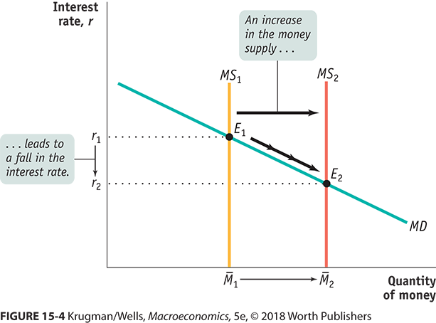

```{r setup, include=FALSE}
knitr::opts_chunk$set(echo = FALSE)
knitr::opts_chunk$set(fig.width=12, fig.height=8) 
```

## Goals

+ Why we manipulate the money supply
+ How we manipulate the money supply
+ Limitations to how we manipulate the money supply

## Why

+ We can directly manipulate inflation
    + That can have short-run Philips Curve effects
+ We can manipulate short-term interest rates (and long-term)
    + Interest rates help determine Gross Domestic Private Investment, I.
    + Long-term too.

## Is There a Demand For Money

+ Yes, there is a demand for money.
+ There is an inverse relationship between short-term interest rates and money holdings.
+ It is the flip side of the supply of loanable funds.
+ If the interest rate goes up you are willing to loan more because you want to hold less.

This is a liquidity preference model.

## Yes, It Does Shift

These increase demand.

+ If the price level goes up, you need more money to buy the same item at the same interest rate.
    + Example, I usually keep $20 on hand for incidentals.
    + When I was 18, I kept $5 because the price level was lower.
+ If real GDP increases
    + More things to buy.
+ If cash is "required" for more purchases.
    + Think of the transactions you don't want a record of
+ Other institutional changes
    + Maybe things like bitcoin become _more_ volatile.


## Money Supply

That was the last chapter.

+ We represent that as a fixed quantity
+ IRL, the money multiplier changes a bit with the interest rate

## All Together



## What Does The Fed Do to Manipulate the Money Supply?

+ Open Market Operations -- buy government debt to manipulate the interest rates banks charge each other. 
    + There are a bunch of other open market operations that started in the 2008 recession that buy securitized mortgages and other assets.
+ Discount Window(s) -- The rate the fed charges banks when they borrow 
+ Reserve Requirements -- The sledgehammer of monetary policy.  Not really a tool.

## How Does Open Market Operations Work?

The Federal Reserve buys and sells short-term, 3-month, treasury securities.

+ They buy it from someone, not from the Federal government directly.
+ That person has a bank account, and that bank has an account at the Federal reserve.
+ They deposit the purchase price of the security in the reserve account of the bank.
+ The money multiplier process takes off.


## Purchases and Sales


+ Open Market **Purchases**, increase the money supply
    + MS shifts right
    + Short-term interest rates fall
+ Open Market **Sales**, decrease the money supply
    + MS shifts left
    + Short-term interest rates increase

The idea is to alter the Federal Funds Rate (FFR), which is the interest rate that banks lend to each other over very short, overnight, time frames.

## For Now

+ Think of increases in the FFR as being contractionary.
    + Do this if an inflationary gap.
+ Think of decreases in the FFR as being expansionary.
    + Do this if recessionary gap.

## Federal Funds Rate


```{r echo=FALSE, message=FALSE, warning=FALSE}
library(alfred)
library(tidyr)
library(dplyr)
library(ggplot2)


get_alfred_series("FEDFUNDS")  %>%
  filter(realtime_period == max(realtime_period)) %>%
  ggplot(aes(y = FEDFUNDS, x = date)) + 
  geom_line() + ylab("FFR (%)") + xlab("")
  

```


## They Aim For a Range

+ Since 2008 our target is a range of 0.25\%.
+ They buy and sell daily to keep in that range.
+ Also since 2008, we buy and sell more than just short-term and more than just treasuries.  That is what Quantitative Easing was about.
+ The Discount Rate(s)
    + Fed loaning to banks
    + Primary is between .25% and 1% higher and the secondary is higher than that.
    + They want to give access but prefer that banks lend to each other.
    
    
## Upper Bound

```{r echo=FALSE, message=FALSE, warning=FALSE}
library(alfred)
library(tidyr)
library(dplyr)
library(ggplot2)


get_alfred_series("DFEDTARU")  %>%
  filter(realtime_period == max(realtime_period)) %>%
  ggplot(aes(y = DFEDTARU, x = date)) + 
  geom_line() + ylab("Upper Bound FFR (%)") + xlab("")
  

```

## What You See

+ Lower bound is 0.25\% below this.
    + To be clear, the lower bound was zero for a long time.
+ Lower bound was zero prior to 2016
    + Lets be clear, you can't have negative nominal interest rates.
+ Has been cranking up in steps since January 2016
    + You need to have an interest rate above zero if you want to lower it later.
    + They needed to be doing this.

## Connection to  Fiscal Policy

+ [**Remember**](https://www.brookings.edu/interactives/hutchins-center-fiscal-impact-measure/) how the net effect of fiscal policy was contractionary until January 2016? 
    + Monetary policy had to be expansionary to counteract.
    + Starting in 2016, fiscal policy turned expansionary
+ That is when the interest rate target started going up, i.e., contractionary.
    + This gives them room to lower the interest rate, expansionary, later.
    + Not a lot of room.
    
## Latest Fed Statement

https://www.federalreserve.gov/newsevents/pressreleases/monetary20190501a.htm

+ "[the] Committee decided to maintain the target range for the federal funds rate at 2-1/4 to 2-1/2 percent"

## So, about that Zero Lower Bound?

+ Look at the yield curve in [**2009**](https://www.treasury.gov/resource-center/data-chart-center/interest-rates/Pages/TextView.aspx?data=yieldYear&year=2009).
    + That is as close as you can get to zero for short-term
+ What did they do?  You can't go below zero on nominal interest rates?
+ They bought longer-term, 5-year, not 3-month, Treasury securities. 
+ This is what they called quantitative easing.

## The Yield Curve

+ Normally, interest rates increase as term increases, i.e., the term premium.
+ In "normal times", say [**2004**](https://www.treasury.gov/resource-center/data-chart-center/interest-rates/Pages/TextView.aspx?data=yieldYear&year=2004), it is two or three percent 
+ But, [**now**](https://www.treasury.gov/resource-center/data-chart-center/interest-rates/Pages/TextView.aspx?data=yield) it is inverted.
    <!-- + That  small difference is an indicator that we are heading to a recession. -->
    + low long-term and high short-term, it is stronger evidence a recession is coming.
    <!-- + If the yield curve inverts, like [**mid-2000**](https://www.treasury.gov/resource-center/data-chart-center/interest-rates/Pages/TextView.aspx?data=yieldYear&year=2000) low long-term and high short-term, it is stronger evidence a recession is coming. -->


## Why are They Doing This?

Federal Reserve Mandate: Maximizing Employment, Stabilizing Prices, and moderating long-term interest rates.

+ Yes, those are contradictory.
+ Depending on the year, we focus on some objectives more than others
+ If the Fed focuses on inflation, they are usually called Hawks, and if unemployment, Doves.

## Models of Fed Behavior

+ Changing the interest rate to force changes in investment, I.
+ Targeting some combination of inflation rate and unemployment.
    + They are required to do this but the balance is unclear.
    + This is the Taylor Rule interpretation of Fed actions.
    + The usual is $FFR = 2.07 + 1.28 ~inflation - 1.95 ~Unemployment~Gap$
+ They are targeting inflation -- 2% is our current target.
    + Sometimes they are targeting inflation expectations.

## Right Now

Making sure there is room to lower interest rates, expansionary monetary policy, for the next recession.
