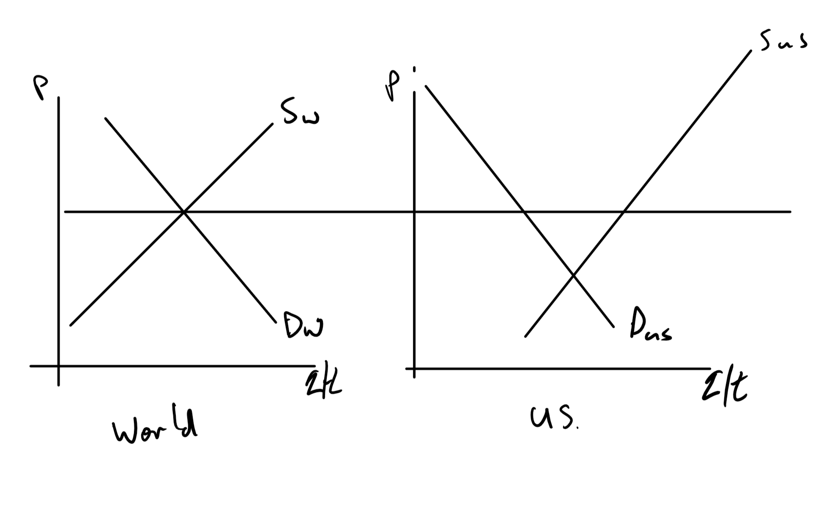
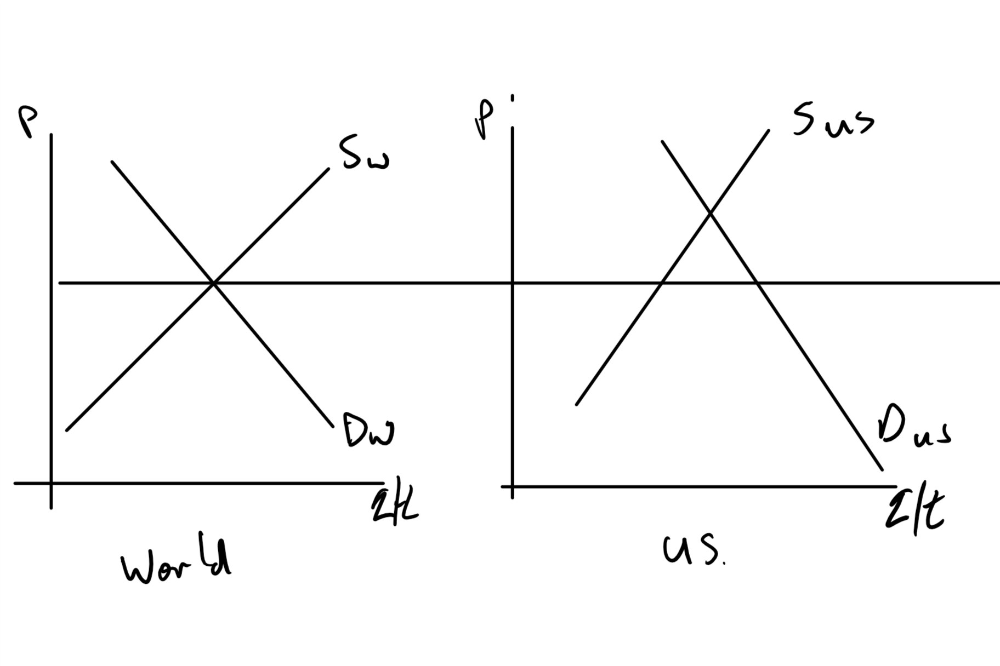
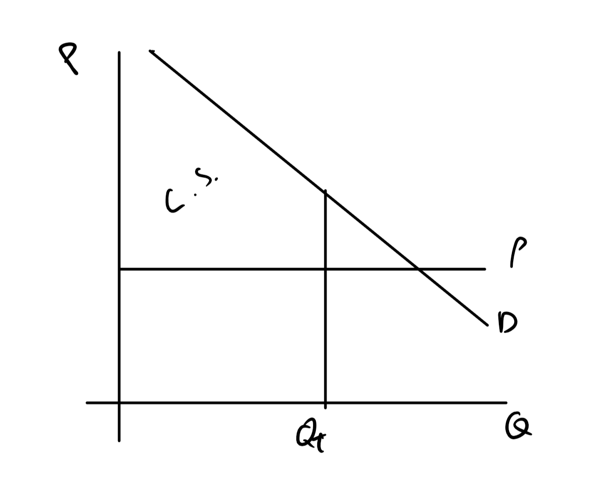
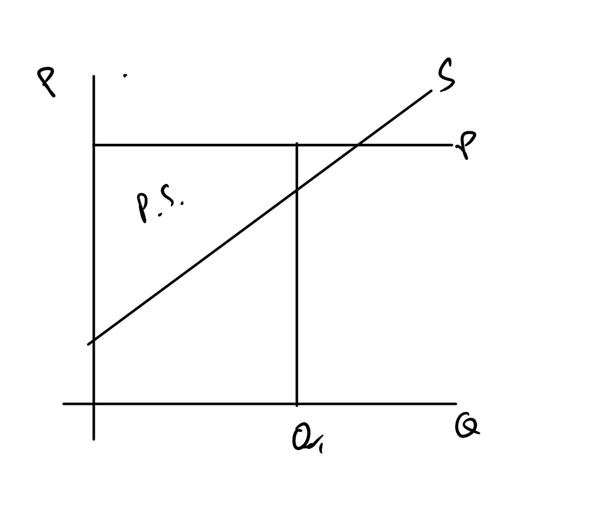
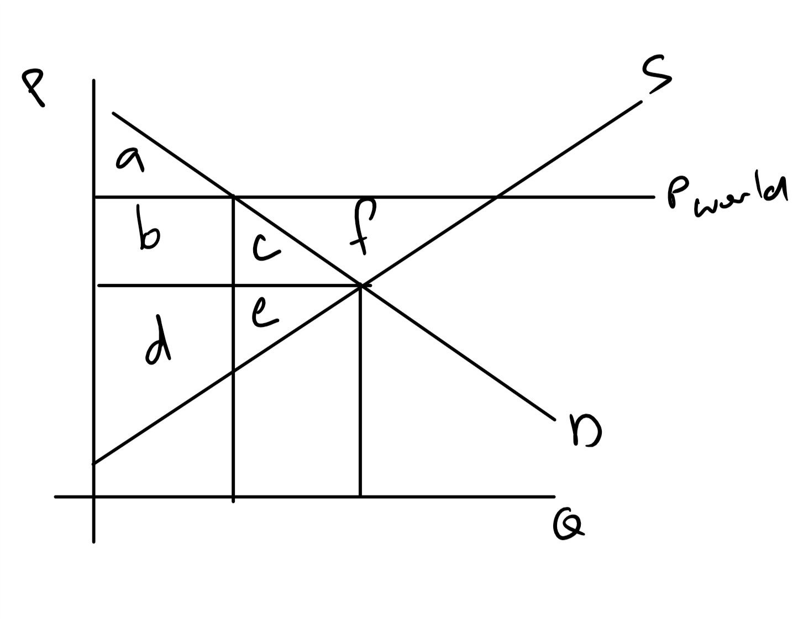
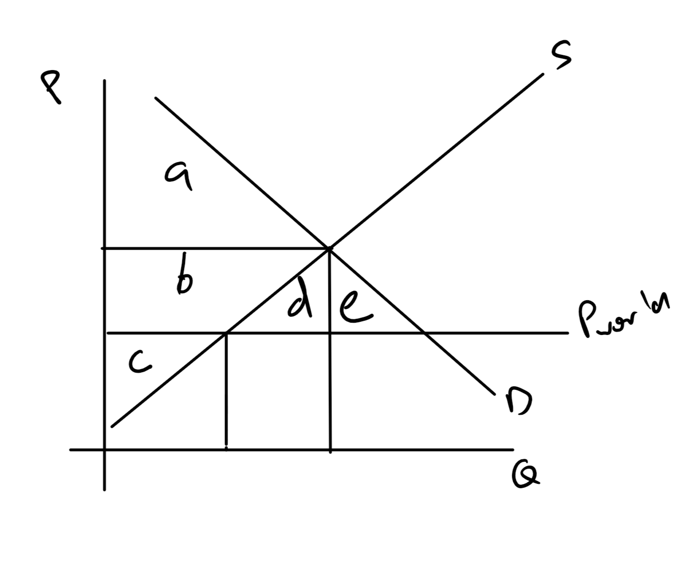
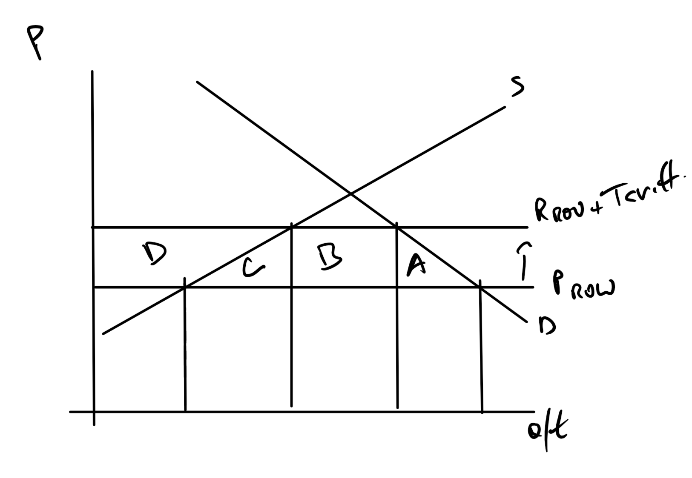

```{r setup, include=FALSE}
knitr::opts_chunk$set(echo = FALSE)
```

## We Talked A Little About Trade   

We talked about the basis for trade, differences in opportunity costs, but we need to expand on that idea.


## Economics has Many Models of Trade

+ They all have some limited support
+ None really explains everything
    + Some are good at intra(inside)national trade
    + Some are good at peer-to-peer international trade
    + Some are good at final goods, but not intermediate goods.
    
    
## We are Sticking to Heckscher–Ohlin

+ I won't show you the model, just the implications.
    + The model is a few classes past this one.
+ Heckscher–Ohlin (H-O) uses the ideas from Chapter 2 about PPFs and comparative advantage
    + All countries use the same technology
    + But countries have different endowments -- different amounts of labor and physical capital are most common.
    + Does not require mobility of labor or capital -- but it helps speed up factor price equalization (wage rates and interest rates)


## Rough Outline of H-O Idea

+ Countries have different endowments of labor and capital (or even timber and coal, etc.)
+ Countries with high labor endowments have a comparative advantage in labor intensive goods (Bangladesh and Clothing)
+ Countries with high capital endowments have a comparative advantage in capital intensive goods (US and airplanes)


H-O works well within a country but not necessarily between.  It is like you need more than just a market to make it work.


## H-O is Static

+ Does not endogenously (within the model) allow endowments to change.
+ But, people, e.g., Paul Romer (Nobel 2018), have models that allow for endogenous technological change and factor changes.
    + Not all these models are strictly trade models.
    + Romer is more about growth

## But there are some Easy Extensions of H-O

Rybczynski Theorem -- Increases in a factor of production, more than proportionally increase output of goods that use that factor intensively.

Huh?

+ If you get more low skill immigrants, you increase output of goods that use low skill workers by a more than proportional amount.
+ Upshot -- low skill immigration probably allows lower skill people already in a country to have more  employment possibilities.


## And Another


Stolper-Samuelson -- Goods prices drive factor prices


Huh?

+ If the price of forest products falls, then wages in the forest products industry falls.
+ But, wait, can't I change jobs?

## Yea, but

Factor Price Equalization Theorem: Even without factor mobility, factor prices will equalize. 

Huh?

+ Yes, you can change jobs but the changes echo
+ Only seems to work with similar countries (US vs CA)

## Keep these ideas in mind

These are all ideas from classes that come after this, but keep them in mind when we are looking at supply and demand graphs.

+ There are some odd implications in macro because "Principle #10: One person’s spending is another person’s income."


##  A Supply and Demand Model

+ This is about perfect competition.
+ All countries are "small"
    + No one country can manipulate world price by altering sales
    + No one country can manipulate world price by altering purchases.
+ They can alter prices within their country.


## Key Intuition

+ If the domestic price is lower than the world price -- export
    + Sellers have the choice of selling domestically or  internationally.
    + They pick the high price and don't sell at the domestic price.
+ If the domestic price is higher than the world price -- import.
    + Buyers have the choice of buying from domestic or international producer.
    + They pick the low price and don't pay the high price that domestic producers want.
    
Trade equalizes domestic and international prices.

## Exporting



## Keep in Mind

+ Price of output is going *up* for sellers.
+ Stolper-Samuelson says the prices of factors that are used intensively in creating the export good -- increase.

See why there is political support for exporting when you work in an export industry?


## Importing




## Keep in Mind

+ Price of output is going *down* for sellers.
+ Stolper-Samuelson says the prices of factors that are used intensively in creating the imported good -- decrease.

See why there is political support to close off imports when you work in an import competing industry?
    
## But Are We Really Better Off?

+ Can't tell by just looking but.
+ We can do some welfare analysis (consumer and producer surplus) to see.
+ Keep in mind that CS/PS is one form of welfare analysis (How well off we are) and  that others are in use.
+ CS/PS is great for one market at a time, when there are few linkages to other markets.

## CS Basics



## Focus on

+ The area above price, below demand up to quantity transacted.
+ The benefits that buyers receive beyond what they paid for the good.
+ The difference between what they were willing to pay and what they actually paid.
+ More  is better.

## PS Basics



## Focus on

+ The area below price, above supply up to quantity transacted.
+ The benefits that sellers receive beyond what they sold the good for.
+ The difference between what they were willing to sell goods for and what they sold them for.
+ It is economic profits plus fixed cost.
+ More is better.

## Do export and imports make us better off?


+ This CS/PS analysis does not look at the effect on factor markets, wages and rental rates (price of capital)
+ Ignores effects on the rest of the world (ROW)

## Welfare Changes from Exports




## Summary

+ Consumers:
    + No trade: A + B + C
    + With trade : A
    + Ouch!
+ Producers:
    + No trade: D + E
    + With trade: D + E + B + C + F
    + Woot!
    
Note that trade added F.  That means in this market, society as a whole is better off, but domestic consumers are worse off.


## Welfare Changes from Imports




## Summary

+ Consumers:
    + No trade: A
    + With trade : A + B + D  + E
    + Woot!
+ Producers:
    + No trade: B + C
    + With trade: C
    + Ouch!

Note that trade added D + E.  That means in this market, society as a whole is better off, but domestic producers are worse off.
    
    
## Politics Check-in

If ROW > Domestic

+ Sellers want to export
+ People that work in export industry want to export
+ Consumers want to keep the low domestic prices and don't want to export.

If ROW < Domestic

+ Buyers want to import
+ People that work in the import competing industry don't want  imports.
+ Sellers want to keep the high domestic prices and don't want to compete with exports.

Principle 4: People usually respond to incentives, exploiting opportunities to make themselves better off.

## What Can You Do

+ Non-Tariff Barriers -- Lots of things
+ Tariffs -- Tax on Imports or Exports
+ Quotas  -- Limitations on Imports or Exports


## Non-Tariff Barriers

This is the most diverse category it includes things like:

+ Health and safety standards (Generally resolved by setting joint standards)
+ Bureaucratic delays
+ Packaging and labeling standards
    + NAFTA required French, English and Spanish for some goods.
    + Notice the stuck on nutritional labels
+ Local content requirements (WTO goes after this if it gets out of hand.  There are exceptions.)
+ ...


## Generally

WTO is a huge body of international law negotiated, starting in 1947, by more than 100 countries that cover trade. There are a few key ideas:

+ MFN Rule:  Treat everyone the same.  You give a concession to one member, you give it to all.
+ Treat foreign the same as domestic.
+ Binding and transparent agreements
+ Safety valves.  There are exceptions and ways to trigger them.

There is a reason that international trade is a specialty area for economists.  There are at least 60 treaties.

## Why Impose a Tariff 

+ Originally, it was one of the few really effective ways to collect tax revenue.
    + Ports were limited.
    + Charge people for stuff coming off boats or as they crossed one of few roads
+ Modern use is either more manipulative or aimed at 'level playing fields'


## Import Tariff

+ ROW < Domestic
+ This is a tax on imports
+ Intended to protect high cost domestic producers.

## Import Tariff



## Summary Tariff

+ Imports decrease and domestic price increases
+ All welfare losses come from consumers
+ Consumers
    + Before Tariff: A + B + C + D 
    + After Tariff: ALL GONE
+ Domestic Producers:
    + After Tariff: D
+ The losses (or not depending on viewpoint)
    + Revenue from Tariff: B
    + Higher payments to domestic factors of production: C
    + Loss to consumers that can no longer afford the good: A
    
    
Clearly, domestic producers and those that work in the industry are in favor, but there is a social cost (C and A).

## How About a Quota

+ I will model a quota that only allows the same amount of exports as the tariff allows.
+ Why?  So I can use the same diagram.

    
## Import Tariff


## Summary Quota

+ Imports decrease and domestic price increases
+ All welfare losses come from consumers
+ Consumers
    + Before Tariff: A + B + C + D 
    + After Tariff: ALL GONE
+ Domestic Producers:
    + After Tariff: D
+ The losses (or not depending on viewpoint)
    + *Quota Rent*: B
    + Higher payments to domestic factors of production: C
    + Loss to consumers that can no longer afford the good: A

The quota rent goes to somebody.  Sometimes it is an import firm, sometimes a foreign firm, sometimes a foreign government.


## A few Things to Note

+ Imposing a tariff or a quota, does help an industry and the workers in that industry.
+ Probably hurts consumers.
+ Having a tariff imposed on you will hurt your industry.  Check soybeans recently?


## Story of A Tariff

+ Great Depression was just getting started....  October 1929
+ Senators Smoot (Utah) and Hawley (Oregon) say we have an idea:
    + Lets increase agricultural tariffs and decrease industrial tariffs.
    + Others say, "Better idea. Lets increase all tariffs"
    + March 1930
+ Then May 1930
    + 1000+ economists sign letter asking to please veto
    + Bankers and others beg for it not to be done.
    + Signed into law June 1930
+ Retaliatory tariffs the world over 


The Smoot-Hawley Tariff is what made the Great Depression "Great"