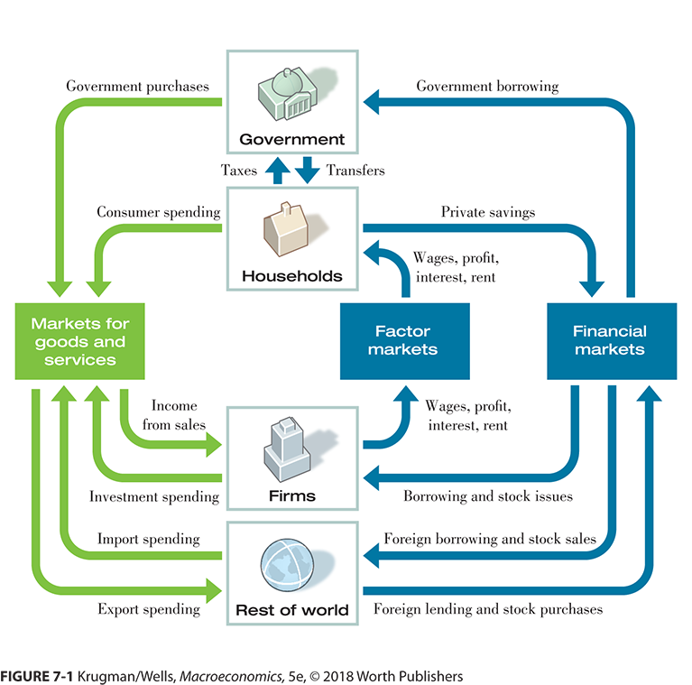

```{r setup, include=FALSE}
knitr::opts_chunk$set(echo = FALSE)
```


## The National Accounts

+ We measure output in our economy two different ways
    + There are three conceptual ways: Goods, Value added and income
    + The data comes in two flows
        + National Income
        + National Product
        
+ The two ways correspond to the money and goods path through the circular flow model.

##



## GDP is


The total value of all final goods and services produced in an economy during a give year.


... and we are talking nominal, i.e., with current prices.

## Final?

Yes, some businesss produce goods that are used by other businesses to produce goods.

+ We only count the last, final, good.
+ Avoids double counting and having number that change when firms are virtically integrated vs not.

## Example of Double Counting

+ Vertically integrated firm.
    + Starts with ore out of the ground and produces 
    + The final good is a $10 wrench
+ Separate Firms create steel and the machine it.
    + Firm one makes and sells $2 of steel
    + Firm two turns steel into $10 wrench
    + $12 with double counting.
    
Note that the end product is the same wrench.

## GDP is Broken Into a Few Parts

+ Goverment (G): This includes all purchases by all level of government including mosquito abatement districts.

+ Consumer Spending (C): Almost everything you and I buy except new, not existing,  houses.

+ Gross Domestic Private Investment (I):  New plant, equipment and buildings.  Also changes in inventory.

+ Exports (X): What we sell to the rest of the world

+ Imports (M): What we buy from the rest of the world.


$$GDP = C + I + G - M + X$$

## A Few Key Definitional Issues

+ Non-market goods don't count.
+ Governemnts do not *invest* in the GDP sense. If a government buys a new building it is G.  If a business or individual buys a new building it is I.
+ Buying stocks and the like is not investment in the GDP sense of I.
+ The only I that households do is new houses.
+ Exports and imports includes intermediate goods.
+ If business make something and don't sell it, it goes in I.
+ The inventory of I bridges some years.
+ Used/existing goods, including houses, are tricky.


## Non-Market

If you and your neighbor clean your own houses -- no change in GDP. But, 

+ If *you* clean the *neighbors* house for \$20.
+ and your *neighbor* cleans *your* house for \$20.
+ C goes up by \$40 and GDP goes up by \$40

It is about what happens in the marketplace.  Home production does not count.  


## Example G is never I

A *new* building gets purchased

+ If governement buys it then G.
+ If a business buys it then I.
+ If a person buys it then I.

## Financial is Never I

Buy some stock 

+ The purchase is not part of GDP, but
    + The fees and commisions can be part of GDP
    + Buy $100 of stock with $10 commission
    + The $10 commision is a service.
+ If
    + Government buys then $10 increase in G and GDP.
    + If business buys then no change in GDP (Intermediate good)
    + If a person buy then $10 increase in C and GDP
    

## Buying Existing Houses

The 100K house is not, since produced in previous year, but the 10K in services required to buy the house, realator, title search are:

+ If governement buys it 10K in G.
+ If a business buys it then nothing (intermediate good).
+ If a person buys it then 10K in C.

## Exports

Suppose you have a firm that produces an intermediate good like steel. $2 of steel

+ If sold to a domestic firm that makes $10 wrenches.
    + $2 of steel is not part of GDP
+ If sold to a firm outside the country that makes $10 wrenches
    + The $2 is part of X and GDP goes up by \$2
    
## Import Intermediate Good

You always subtract imports

Firm buys \$2 of steel, an intermediate good, to produce a \$10 wrench, which is sold. 

+ M increases by \$2
+ C increases by \$10
+ GDP increases by \$8 = \$10 - \$2
    
    
## Import Final Good

Buy imported $10 wrench

+ M increases by \$10
+ C increases by \$10
+ GDP does not change $0 = \$10(The C part) - \$10(The M part) 

## Made but Unsold Goods

I is a bridge between years.

+ This year
    + $10 wrench is made but unsold.
    + I goes up by $10.
    + GDP goes up by $10.
+ Next year
    + The $10 wrench made last year is sold.
    + I goes down by $10.
    + C goes up by $10.
    + No net change in GDP.
    
    
Goods produced in earlier years changes the composition of GDP but not the total amount.

## Used Goods

Used goods are not part of GDP when sold, the are not current year production, but the value added, *the services provided*, by selling them is.  Suppose you bought a used car for \$1,000 and then sold it for \$1,200.

+ The value added is \$200 = \$1,200 - \$1,000
+ C and GDP increase by $200.

## The Ugly One -- Housing

+ If you rent for $1,000 then:
    + C increases by $1,000 and
    + GDP increase by $1,000.
+ If you buy a new, 100K home one year then:
    + In the year you buy the new, not existing home, I and GDP go up by 100K
    + In the years after that, GDP and C go up by the amount of 'rental services', say, \$1,100
+ If you buy an existing, 100K home one year.  Pretend there are now fees or other value added on the transaction.
    + The purchase has no effect on I or GDP (not current year)
    + The imputed rental services are part of C.
    
    
This is the big reason why GDP is updated with the census.  That is when we find out about housing.

##


Clear as Mud yet?

## So, in summary

+ Only this years production can change GDP
+ Previous years production doesn not alter GDP but can change the composition.
+ G is always G
+ Business expenditures are not part of GDP unless they are investments or inventory, then I.
+ Used goods are not part of GDP but the transaction services are.
+ Houses are usually valued by imputed rental services.
+ All exports, even intermediate goods, are GDP.
+ All imports, even intermediate goods, are subtracted from GDP.


## Interpreting GDP and GDP Growth

+ Increases in GDP or per capital GDP does not mean that people are better off.
+ One country having a higher per capital GDP does not mean that standards of living are higher.

## GDP is not all good

Economists do not screw this up but [**others**](https://www.cnbc.com/2017/09/08/feds-dudley-hurricanes-will-boost-economic-activity-over-the-long-run.html) do. 

+ GDP is a flow measure, $/year, like galons per minute into a tub.
+ Wealth is a stock measure, $, like galons in a tub.

If a disaster hits:

+ $1,000 of damage to you house
+ $1,000 to repair the house (GDP goes up)
+ Your house is now worth what it was before but you just paid an extra $1,000.

## But it tracks well

Death, mayhem, earthquakes, all increase GDP but not our well being, but we generally get more good than bad.

## The Major Missing Parts

+ Externalities -- polution, climate change, weiting in trafic.  Only count if you try to fix them.
+ Non-Market Transaction -- Household production.
+ Quality Improvements.
+ Sustainability -- Cut down some trees good. Cut down all the trees bad.

## Any Alternatives

If you want to use a GDP type measure for wellbeing, yes.

+ [World Happiness Report](http://worldhappiness.report/)
+ [OECD Better Life Index](http://www.oecdbetterlifeindex.org/)
+ ...

There are a lot of them.

## International Comparisions

This is harder than you think.

+ When you live in a different country you have different consumption patterns.
+ Some internationally traded goods can have similar prices, but
+ Some goods are local and not traded, e.g., haircuts.
+ The relative value of currencies changes moment by moment.

We do use Purchasing Power Parity (PPP) to estimate.

## PPP

The idea is that you buy the same goods in every country and compare how much it costs to get the PPP equivelent.

+ Basket of haircut, beer in Mexico is about 200 Pesos.
+ Same products in US is $30.

Warning: Not real numbers.


If you want to convert Mexico's 8T Peoso GDP to US dollar terms.

$$1.2T~US\$(PPP)  = 8T~MEX\$ \frac{30~ US\$}{200~ MEX\$}$$

Currency exchange rate is 20 Mex\$ = 1 US\$ and you can use that but the baskets are different.


## PPP vs Exchange Rate

+ If you adapt your basket to the country, exchange rate works.
+ If you don't, PPP.

## Price Indexes

We talked a lot about the CPI in the last chapter

+ We focused on the CPI measures.
+ We introduce two more:
      + Producer Price Index
      + GDP Price Deflator
+ Please Note that there are way more
    + Import Price index, etc.
    + Personal Consumption Expenditure Price Index.
    
The Federal Reserve Open Market Committee (The Fed) tends to focus on the PCE because it can control the defintion and is not built into law.


## Producer Price Index

+ Covers all products, even intermeditate ones that somehow effect consumers.
+ Even expenditures by non-profits for people.


It tends to react faster than CPI.
