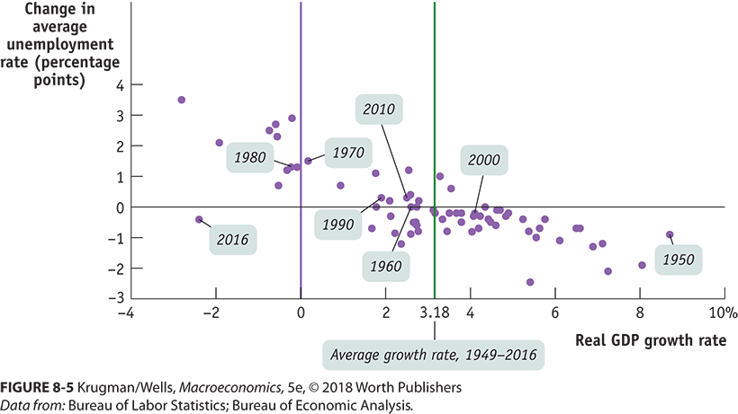
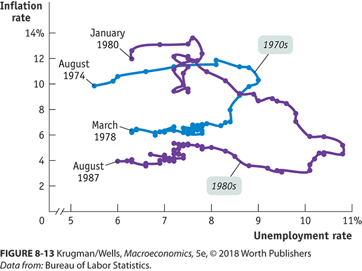

```{r setup, include=FALSE}
knitr::opts_chunk$set(echo = FALSE)
```


##  Goals

+ Deeper dive on both unemployment and inflation
+ How do we think about causes of unemployment
+ The relationship between unemployment, and its determinants, and inflation.


## Recall

+ We find out about unemployment rates through the Current Population Survey.
+ We report out monthly
+ We have several alternative measures of unemployment, U1 - U6, with U3 being the official rate.

## In the past ...

+ The Current Population Survey (CPS) has:
    + Been designed with a concern about job loss through automation
    + Struggled with how to define both employment (at least an hour for pay or profit) and unemployment (looked for and available in the last 4 weeks)
    + The U1- U6 measures use a variety of definitions
+ Always, at least starting in the 40s, with an interest in who could work


Economists are interested the maximum amount of labor but also why people are not working, under a variety of definitions.

## Why?

+ The amount of people working tracks population
    + Variations because of changing birth rates.  
    + Boomers and Millennials are known BOOMS and Xers are known BUSTS.
+ You can get everyone working but it pretty expensive to do.
    + Everyone = Everyone 16 years or older and not institutionalized.
    + Increasing opportunity cost
    + Imagine working a 60 hour week for months on end.
        + Fatigue
        + Mistakes
        + Breakdowns
        
The practical limit is something less than everybody.

## Labor Force Participation Rate

$$Labor~Force~Participation~Rate = \frac{Employed + Unemployed}{Uninstitutionalized~Popluation~16+} 100$$

Remember that Employed and Unemployed is defined as the labor force.

## History of Labor Force Participation Rate

```{r echo=FALSE, message=FALSE, warning=FALSE, paged.print=FALSE}
library(alfred)
library(dplyr)
library(ggplot2)

get_alfred_series("CIVPART") %>%
  ggplot(aes(y =CIVPART, x = date)) + 
  geom_line() + ylab("Labor Force Participaton Rate") + xlab("")

```

## You Can Clearly See

+ Women entering the economy starting in the mid-60s
+ The peak in 2000 with all the boomers working
+ Small tail off from the boomers starting to retire
+ Big drop offs since 2008.
    + Some are retirements
    + Some are discouraged workers 
    
## Your Mileage May Vary

Here are the 2016 labor force participation rates with projections by gender, race and ethnicity.

https://www.bls.gov/emp/tables/civilian-labor-force-participation-rate.htm

A few things of note: (Grossly Simplifying!!!!!!)

+ You can spot either gender role or salary differential in child raising years
+ After 65 the gender gap in participation is even higher.
+ Hispanic Men top the list of participation rate, but some of this is age distribution.

    
## The Interesting Connection to the Unemployment Rate

The unemployment rate is:

$$Unemployment~Rate = \frac{Unemployed}{Employed + Unemployed} 100 $$

You can make the unemployment rate change a few ways.

Math Time ...

## How to Decrease the Unemployment Rate

$$Unemployment~Rate = \frac{Unemployed}{Employed + Unemployed} 100 $$


+ You can increase the number of people with jobs, i.e., the employed
    + The number of unemployed stays the same
    + The denominator gets bigger
    + The fraction unemployed shrinks
+ You can decrease the number of people unemployed, i.e., get them out of the labor force.
    + You can institutionalize people
    + Discourage them
    + Numerator goes down
    + Denominator goes down but not by as much
    + Unemployment rate falls.
    
This is why you need to look at more than just the unemployment rate.

## There is also no one unemployment rate

Here is unemployment by Age, Race and Gender

https://www.bls.gov/web/empsit/cpsee_e16.htm

A few things of note: (Grossly Simplifying!!!!!!)

+ African American rate is about X2 White/Asian with Hispanic somewhere in the middle.
+ Teens have very high rates, but the female rate is lower.

## The Relationship Between GDP Growth and Unemployment Rates 




## Quick Note

+ Macro has a lot of NAME curve or NAME relationships.
+ These are, for the most part, empirical relationships.
+ They create a theory after the fact.
+ Many have an anoying property, once you try to use them as a policy lever, they vanish.
    + Does not happen in the physical sciences.
    + Atoms do not anticipate policies or have a model of self.
    + Goodhart's law:"Any observed statistical regularity will tend to collapse once pressure is placed upon it for control purposes."


## Okun's Law

+ More exactly a rule of thumb
+ 1% increase in unemployment is associated with a 2% decrease in GDP growth.
+ This is an empirical relationship, not a policy lever.
    + Car has peddles to control speed
    + Also speedometer.
    + Turning the speedometer does not change how fast you go, but
    + Strong empirical relationship with speed of car.
+ Can get GDP growth w/o changing unemployment
    + Increased productivity
    + Increased capacity utilization (unemployment rate for capital)


## So much for measurement

Lets get into the why part of unemployment.

Economists Define a few "Why"

+ Frictional: Between jobs.  The normal search time.
+ Structural: Changing industry composition, technological change. Your job is not as common where you live.
+ Cyclical: Output in your industry increasing and decreasing. Hours worked adapts (Okun's law intent)


## Frictional

This is the normal time it takes to get a good match on a job.

+ Not all jobs are the same.
+ Work cultures differ.
+ It can be a bit like dating.
+ Institutions matter
    + Academic job cycle is one year
    + Job boards with automated scanning of resumes
    + Part-time agencies and freelance boards
    
## Shrinking Frictional is not  Always Good

+ Searching longer means a better match and higher wages or well-being.
+ This is the US
    + Easiest way to get a raise is to change jobs
    + Easiest way to get a vacation is to change jobs

## Structural

This is because technological change or big global trends in industry composition.

+ If your industry is rapidly automating (Forest products)
+ If your industry started competing with Chinese imports
+ Industry moving and you are not.

## IRL Not All is Counted as Unemployment

Autor, David H., David Dorn, and Gordon H. Hanson. 2013. "The China Syndrome: Local Labor Market Effects of Import Competition in the United States." American Economic Review, 103 (6): 2121-68.

" [...] 9.9 percent of those who lose employment following an import shock obtain federal disability insurance benefits."

"For regions affected by Chinese imports, the estimated dollar increase in per capita SSDI payments is more than thirty times as large as the estimated dollar increase in TAA [*Trade Adjustment Assistance*] payments."

## Structural Unemployment

+ Increases when there is rapid technological change because human capital is slow to adapt on individual basis.
+ Costs to adapt can be high.
+ Expect more of this.

## Institutions Can Also Effect Structural

The usual suspects are:

+ Minimum wage laws
+ Unions
+ Efficiency Wages
+ Unemployment Benefits

## Minimum Wage Laws

+ US minimum wage laws are far below average wages.
+ Card, David and Alan Krueger (1995) "Myth and Measurement: The New Economics of the Minimum Wage" Princeton, NJ: Princeton University Press.
    + Nothing
+ Outside of US, you may be on to something.
+ Don't get me wrong, low wages probably delayed automation.

## Unions

+ Acts like a minimum wage, price floor.
+ US has low unionization rates and have been falling since the 70s.
    + Private sector is 7.4%
    + Pubic sector is 39.5%
+ Other countries are much higher and do have an effect

No bang on unions.  I'm a member and former negotiator.

## Efficiency Wages

Pay more than you need to so that:

+ People put in effort (No shirking)
+ No churn of employees (Job searches are expensive)
+ Attract the best workers.

## Unemployment Benefits

+ Huge variance on how this is implemented
    + US is a mandatory insurance payment.
    + Ghent System (Denmark, Sweden, Iceland) is through union membership.
    + Government payments
+ The intensity/duration trade-off
    + High payments but short duration
    + Low payments but long duration (Ireland is 193 EUR as long as you are unemployed)
    + More common is 30 months.
    + US is the rare short duration, 6 months.  
    + Most OECD countries are far more than a year.
    
In general, it increases the amount of frictional unemployment and increases quality of the match.  It can also induce people to shirk, if the payments are too high and their skills or income potential are low.    

## The Natural Rate

There are actually two competing concepts:

+ The natural rate, which is the sum of frictional and structural unemployment
+ The non-accelerating inflation rate of unemployment (NAIRU) which is the highest unemployment consistent inflation not increasing.


They can be thought of as being the same but differ when estimated.

## What Makes the Natural Rate Hard

+ We don't have a good month-to-month direct measurement.  Who is frictional and structural.
+ We use the Beveridge relationship, unemployment vs job-openings and longer term trends.

## What Do You See?

```{r echo=FALSE, message=FALSE, warning=FALSE, paged.print=FALSE}
library(alfred)
library(dplyr)
library(ggplot2)

get_alfred_series("NROU") %>%
  filter(realtime_period == max(realtime_period)) %>%
  ggplot(aes(y = NROU, x = date)) + 
  geom_line() + ylab("Natural Rate") + xlab("")

```

## 

+ The long decline since the 80s was a decrease in frictional.
+ Also, more young people and young people going to college.  
+ College grads have a lower unemployment rate.
+ The post 2010 is an uptick in structural
    + Lots of people in construction because of the housing bubble.
    + Bubble bursts and people lose jobs.


## Inflation

+ Price level doesn't mater but the rate of change does

## Costs of Inflation

+ Shoe-leather
+ Menu
+ Unit of account


## Winner and Losers

## Another Empirical Relationship

There is an empirical relationship between inflation and unemployment -- The Phillips curve.


## Phillips curve

