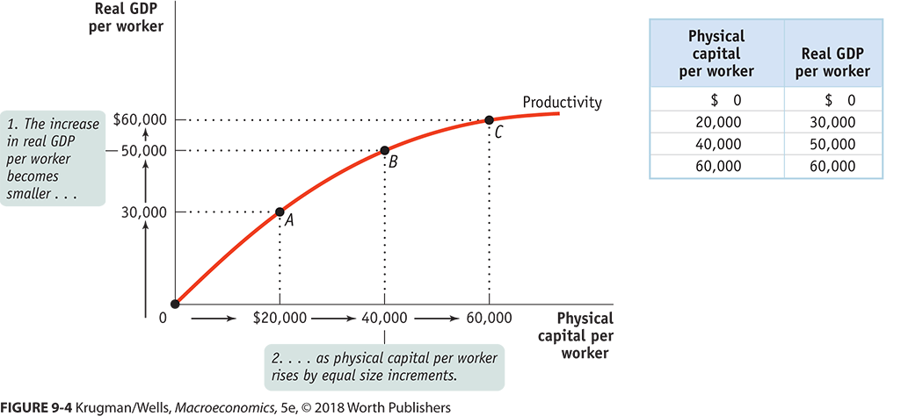
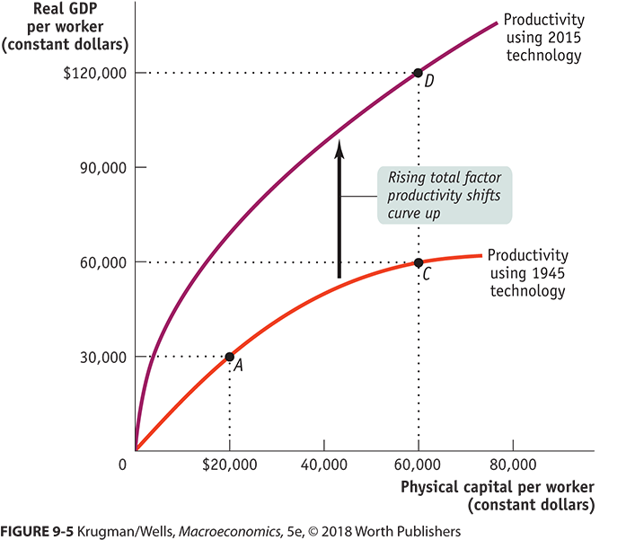
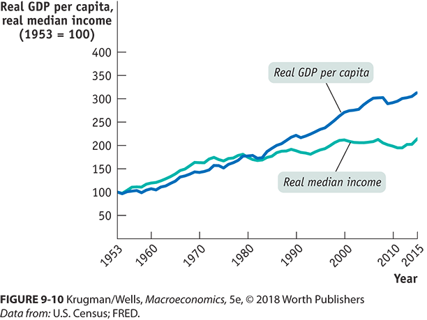

```{r setup, include=FALSE}
knitr::opts_chunk$set(echo = FALSE)
```


## Where we are going

+ Remember that all models are incomplete.
    + They are good at a few things but not everything.
    + Most tend to be good in one area.
+ We have models for:
    + Business cycles
    + Growth
    
The models don't always play well together.  This is about Growth


## We Tend to focus on Per Capita GDP

We focus on per capita real GDP when talking about growth.

+ We are talking about production, not welfare, so GDP is the right measure.
+ We don't want to be fooled by price changes so *real* is appropriate.
+ We don't want to be fooled by scale.

## Lets Look at some 

https://www.indexmundi.com/g/r.aspx?v=67

+ There are a lot of tax havens/banking hubs in the top
    + And some playgrounds for the rich and famous.
    + And OIL
+ European nations are near the top, except Moldova.
+ Much of Africa is near the bottom.
    
## The real key is not where you start

The rate that you grow is key.

+ You can make up for starting low by growing fast.
+ Book gives a "Rule of 70".
    + You may also hear it as "Rule of 72" or "Rule of 69".
    + Divide 70 or 72 or 69 by the growth rate and it tells you how long to double.
    
    
## Example

How long to double \$100 when the growth rate, i.e., the interest rate, is 10\%?

$$\frac{70}{10}=7~years$$

How long to double \$100 when the growth rate, i.e., the interest rate, is 5\%?

$$\frac{70}{5}=14~years$$

## What I mean by Growth Rate Dominates

Caution exact calculations!

Two accounts:

+ One with \$100 and an interest rate of 10\%.
+ One with \$1,000 and an interest rate of 3\%.

Who gets to $10,000 first?

## Well

$$F = P (1+i)^N$$
You can solve for N

$$\frac{ln(F) - ln(P)}{ln(1+i)} = N$$

## In this case 

\$100 and an interest rate of 10% grows to 10K in:

$$\frac{ln(10000) - ln(100)}{ln(1+.1)} = `r round((log(10000) - log(100))/log(1.1),2)`~years$$

\$1000 and an interest rate of 3\% grows to 10K in:

$$\frac{ln(10000) - ln(1000)}{ln(1+.03)} = `r round((log(10000) - log(1000))/log(1.03),2)`~years$$

## Crazy things

+ In 1900 Argentina had higher per capita real GDP than most European countries.
+ Except for the last few centuries, China and India where most of world GDP.

What happened?  Different growth rates.

## So, How Do you Grow Per Capital Real GDP?

+ Increase per capita physical capital.
+ Increase per capita human capital
+ Technical progress that makes human and/or physical capital more productive.

## Physical Capital

Give people more machines to do their job.

+ How to get to school?
    + Walk - 3.2hrs (I timed myself but stopped for a cup of coffee).
    + Drive 10K car - 25 min ~ 0.5 hrs
    
## Human Capital

Education and skills of the population. If you don't believe this, why are you here?

## The most important: Technological Progress

+ This is:
    + New tools and ideas that didn't exist. Like IDEs for programming.
    + Yes, this is massive increase in physical capital, but a technological improvement on people with the finest cross cut saws in the world. https://www.youtube.com/watch?v=m0ZELXwFZkc
+ It is even:
    + Printed receipts
    + Phones where you don't have to remember the phone number.
    
    
## We Can Summarize the Effect of All Three

$$GDP~Per~Capita = T (Per~Capita~Physical)^{.4} (Per~Capita~Human)^{.6}$$

+ The T is technology
+ The .4 and .6 are approximations estimates based on US data.
    + Don't take the exact numbers seriously
    + They are the right scale, physical counts for less than human and technology trumps them all.
    
## What Does that Mean

$$GDP~Per~Capita = T (Per~Capita~Physical)^{.4} (Per~Capita~Human)^{.6}$$

+ Technology helps
+ You can add human and physical capital and get more real GDP per capita but you should balance it out and add both -- not just one.

## See what I mean

$$GDP~Per~Capita = (Per~Capita~Physical)^{.4} (Per~Capita~Human)^{.6}$$

+ Mostly Physical: $4^{.4}+ 1^{.6}= `r round((4^.4) * (1^.6),2)`$
+ Mostly Human: $1^{.4}+ 4^{.6}= `r round((1^.4) * (4^.6),2)`$
+ Balance: $2^{.4}+ 3^{.6}= `r round((2^.4) * (3^.6),2)`$

Investments in human and physical capital suffer from declining returns.  The more you invest the smaller the benefit of investing more.

## Graphical Summary



## So what does T do?

T is the effect of technology

+ The special name is "total factor productivity".
+ Cool kids say "TFP"
+ We have other kinds of technical change to, e.g.,labor augmenting, but not in this class.
+ It stretches the curve up.

## Graphical Summary




## What About Natural Resources?

The math says, it is like starting with more.

+ Remember the example of 100 at 10\% growth and 1000 at 3\%?
+ You need to turn it into growth.
+ Some do and some don't

## Natural Resources are often a curse

Often "The Resource Curse" or "Dutch Disease"

+ Because the extraction industry is so big.
+ Most investment is in that industry.
+ The industry pays more and attracts lots of human capital, starving the others.
+ When prices of the resource change, incomes change a lot.  The price of any one good as more volatile than many.

Examples:
    
+ West Virginia and Coal
+ Venezuela and Oil

One of the hazards of over-specialization.


## So how do you grow?

Don't spend all your money.  Save it and invest:

+ Buy lots of physical capital
+ Spend lots of education
+ Try to increase technological progress.

## Who invests in physical capital


We are looking for countries where I, Gross Domestic Private Investment, is a large fraction of GDP.

https://en.wikipedia.org/wiki/List_of_countries_by_gross_fixed_investment_as_percentage_of_GDP

Check the relative rankings of:

+ China with 7.13% per capita growth from 2010 - 2016
+ World with	1.53%
+ EU 	with 0.71%
+ US with 1.33%

BTW, they are in order of percent investment


## So What Do Countries Do

The short list:

+ Build infrastructure
+ Subsidize education
+ Subsidize R&D
+ Well functioning financial system
+ Enforce property rights
+ Be good at governing and be stable.

## Build infrastructure
## Subsidize education
## Subsidize R&D
## Well functioning financial system
## Enforce property rights
## Be good at governing and be stable.


## A Few Areas To Check in On

+ East Asia
+ Latin America
+ Africa

## East Asia
## Latin America
## Africa


## Productivity in US has gone up but



## Convergence or Conditional Convergence

## Can We Do This Sustainably

Yea, its cheaper than the other way, but different groups benefit.